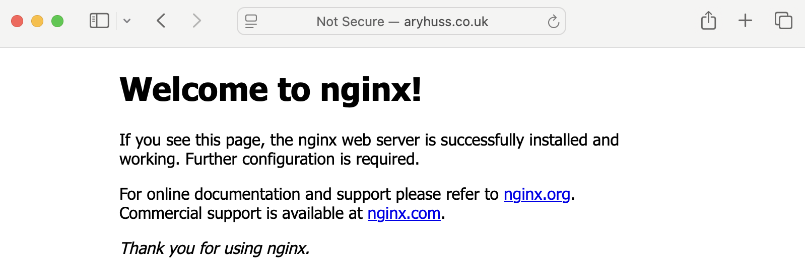
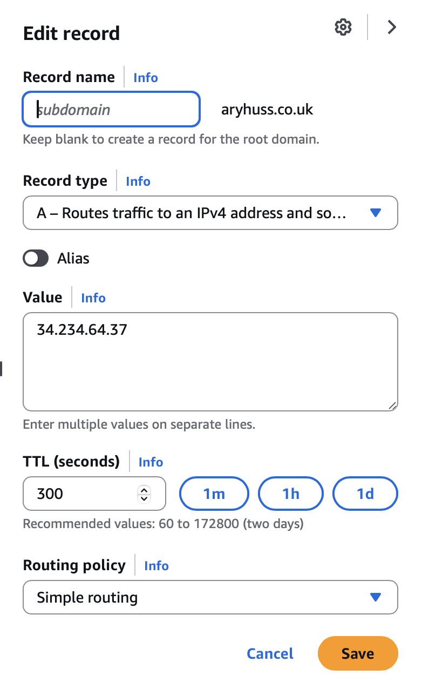
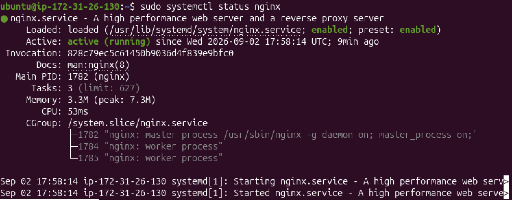

# Networking

This repository documents what I covered during the Networking module of my DevOps learning. It includes my networking notes, useful commands and a practical AWS project where I hosted an NGINX web server on EC2 and connected it to a domain using Route 53.

## What I Covered

Throughout the module I covered:

- LANs and WANs
- Switches, routers and firewalls
- IPv4, IPv6 and MAC addresses
- Ports and protocols
- TCP and UDP
- The OSI model
- The TCP/IP model
- DNS and DNS records
- Routing
- Binary and CIDR
- Subnetting
- NAT and PAT
- Network troubleshooting
- Cloud networking

One of the main things I took from this module was understanding how these topics connect to each other.

For example, when accessing a website, DNS is used to find the IP address associated with the domain, routing helps traffic reach the correct network, and ports identify which service the traffic is trying to reach.

My more detailed notes can be found in [Networking_notes.md](Networking_notes.md).

## Commands

Alongside the theory, I worked with different Linux and networking commands.

These included commands for checking network information, testing connectivity, tracing routes, querying DNS and checking network connections.

I also used SSH to remotely access an AWS EC2 instance and Linux commands to install and manage NGINX.

The commands I covered can be found in [commands.md](commands.md).

---

# AWS Route 53 and EC2 Project

To put some of the networking concepts into practice, I completed an AWS project where I hosted an NGINX web server on an Ubuntu EC2 instance and connected it to a domain using Amazon Route 53.

The aim of the project was to take some of the concepts I had been learning, particularly DNS, IP addresses, ports and cloud networking, and use them in a practical environment.

## What I Built

I started by launching an Ubuntu EC2 instance which would act as my server.

I then configured the EC2 Security Group to allow the network traffic I needed. SSH was required so I could remotely access the server, while HTTP was required so the NGINX website could be accessed through a browser.

After connecting to the instance using SSH, I installed NGINX and made sure the service was running correctly.

I then used Amazon Route 53 to configure the DNS for my domain. I created an A record which pointed the domain to the public IPv4 address of the EC2 instance.

Once everything was configured, I entered the domain into a browser and successfully reached the NGINX welcome page running on the EC2 server.

## Technologies Used

### Amazon EC2

I used Amazon EC2 to create the Ubuntu virtual server that hosted NGINX.

This also gave me practical experience remotely connecting to a cloud server rather than only working from my local Linux environment.

### Amazon Route 53

I used Route 53 to manage the DNS configuration for the domain.

An A record was created to associate the domain with the public IPv4 address of the EC2 instance.

This helped me put the DNS theory from the module into practice and see how a domain is connected to the server hosting a website.

### EC2 Security Groups

I used a Security Group to control which inbound traffic was allowed to reach the EC2 instance.

The two main ports used during the project were:

- **Port 22 - SSH** for remotely accessing the EC2 instance
- **Port 80 - HTTP** for allowing users to access the NGINX web server

This gave me a better understanding of how ports and security rules are used together to control access to services running on a server.

### NGINX

NGINX was installed on the Ubuntu EC2 instance and used as the web server.

After installing it, I enabled and started the service before checking its status to make sure it was running successfully.

---

## Troubleshooting

Not everything worked first time during the project, which gave me the opportunity to troubleshoot some problems along the way.

### SSH Access

To remotely access the EC2 instance, I needed to make sure SSH traffic was allowed through the Security Group and that my SSH private key had the correct permissions.

Working through this helped reinforce why port 22 is needed for SSH and how Security Groups control whether that connection is allowed to reach an EC2 instance.

### NGINX Installation

When I first tried to install NGINX, I received `404 Not Found` errors while Ubuntu was trying to retrieve the packages.

At first I had to work out whether the problem was being caused by my EC2 networking configuration or Ubuntu itself.

The package information on the instance needed to be refreshed. I ran:

```bash
sudo apt update
```

After updating the package information, I was able to install NGINX successfully.

This was a useful troubleshooting experience because it showed me the importance of finding the actual cause of an error instead of assuming it is related to the part of the system I am currently working on.

### Security Group Rules

I also had to make sure I was using the correct inbound rules for the services I wanted to access.

SSH required port 22 while the NGINX website required HTTP traffic through port 80.

This helped turn what I had learnt about ports into something practical because I could see the effect of allowing or restricting traffic to a cloud server.

---

## Project Result

The final result was a working NGINX web server hosted on an Ubuntu EC2 instance which could be accessed through my configured domain.

Getting the NGINX page to load through the domain confirmed that the different parts of the setup were working together correctly.

It showed me in practice how Route 53 could resolve the domain using the A record, how the public IPv4 address identified the EC2 server, and how the Security Group allowed the HTTP request to reach NGINX.

---

## Screenshots

### NGINX Running



NGINX successfully running on the Ubuntu EC2 instance.

### Route 53 A Record



The Route 53 A record configured to point the domain to the EC2 instance.

### Website Working



The NGINX welcome page successfully loading through the configured domain.

---

## What I Learnt

The biggest takeaway from this module was starting to understand networking as one connected process rather than a collection of separate definitions.

Learning about the OSI model gave me a foundation for understanding where different networking technologies operate, while topics such as IP addressing, routing, DNS, ports, TCP and UDP helped me understand how devices actually communicate.

Subnetting and CIDR also helped me understand how IP networks can be divided and organised, while NAT showed me how private networks can communicate with the internet using public IP addresses.

The AWS project was particularly useful because I was able to apply some of these concepts myself. Instead of only learning what DNS or a port does, I configured DNS records, opened specific ports, remotely accessed a server and made a web server available through a domain.

I also gained more experience troubleshooting problems and working through them logically rather than immediately assuming what the cause was.

Overall, the module gave me a much stronger understanding of the networking fundamentals that I will need as I continue learning DevOps and cloud technologies.


